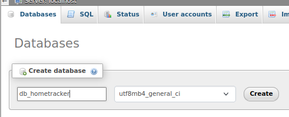
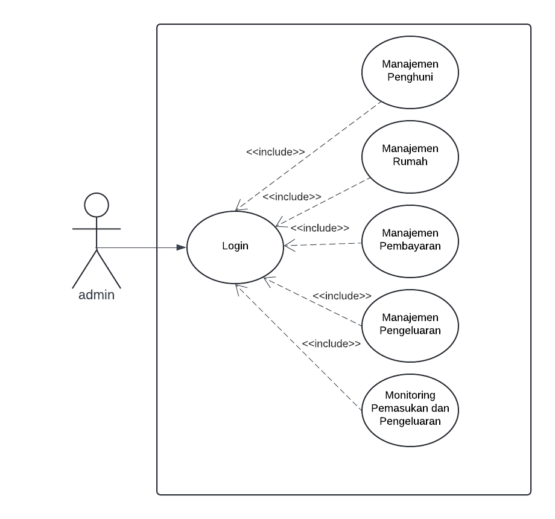
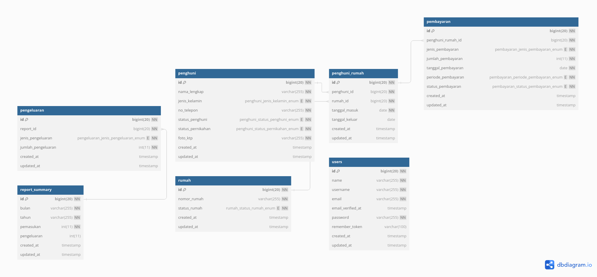

# HomeTracker (Aplikasi Administrasi Perumahan)

Aplikasi ini digunakan untuk mengelola administrasi pembayaran dan pengeluaran iuran bulanan pada perumahan elite.

## Daftar Isi

- [HomeTracker (Aplikasi Administrasi Perumahan)](#hometracker-aplikasi-administrasi-perumahan)
  - [Daftar Isi](#daftar-isi)
  - [Informasi Proyek](#informasi-proyek)
  - [Persyaratan Sistem](#persyaratan-sistem)
  - [Instalasi](#instalasi)
    - [Backend](#backend)
    - [Frontend](#frontend)
  - [Penggunaan](#penggunaan)
  - [Daftar Username-Password](#daftar-username-password)
  - [Framework](#framework)
    - [Backend (Laravel)](#backend-laravel)
    - [Frontend (React)](#frontend-react)
  - [Author](#author)

## Informasi Proyek

Aplikasi ini dibangun untuk memudahkan proses admjnstrasi iuran bulanan dengan fitur-fitur yang mencakup manajemen pembayaran, manajemen pengeluaran, dan pelaporan.

## Persyaratan Sistem

- PHP >=8.0.
- MySQL atau database relasional lainnya (XAMPP/LAMPP).
- Web server (contoh: Apache).
- Browser web modern (Chrome/Firefox).
- Composer
- NodeJS versi  >= 16

## Instalasi

Membuka terminal lalu
Clone repositori ini ke dalam direktori komputer anda

### Backend
- `cd backend`
- `composer install atau composer update` 
- `cp .env.example .env`
- `php artisan key:generate`
- silahkan membuat database dengan contoh
  
- `php artisan migrate --seed`
- `php artisan serve`

### Frontend
- buka dengan beda terminal (cmd/powershell)
- `cd frontend`
- `npm install`
- `npm run dev`

## Penggunaan

1. Akses aplikasi melalui browser dengan [http://localhost:5173](http://localhost:5173)
2. Login menggunakan akun admin.
3. Gunakan menu untuk melakukan pembayaran, pengeluaran, dan melihat laporan.

## Daftar Username-Password

| Email             | Password    |
| ----------------- | ----------- |
| admin@gmail.com   | password    |

## Framework

Aplikasi ini menggunakan kombinasi Laravel sebagai backend dan React sebagai frontend untuk memastikan kehandalan, keamanan, dan antarmuka pengguna yang responsif.

### Backend (Laravel)
- Framework: Laravel
- Versi Laravel: 9.0
- Dokumentasi Laravel: https://laravel.com/docs/9.x
### Frontend (React)
- Framework: React
- Versi React: 18
- Dokumentasi React: https://react.dev/

pastikan sudah menjalankan backend
- User Case Diagram  
  
- Struktur Data Konsep  
  
  

## Author

Firgi Sotya Izzuddin | 2024
